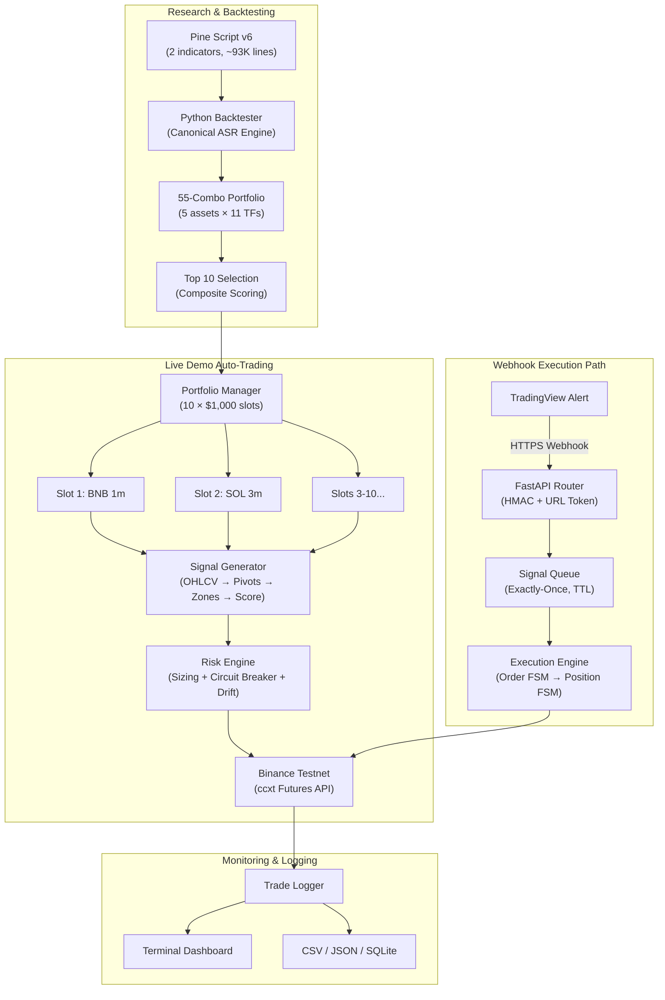

<div align="center">

# ASR Execution Engine

### Advanced Support & Resistance — Algorithmic Trading System

[](https://python.org)
[](https://fastapi.tiangolo.com)
[](https://testnet.binancefuture.com)
[](LICENSE)
[-brightgreen)]()
[]()

**A production-grade, end-to-end algorithmic trading system** that detects structural supply/demand zones using pivot-based price action, validates signals with multi-timeframe confluence, and executes trades autonomously on Binance Futures — from TradingView Pine Script indicator through canonical Python backtester to live auto-trading engine with institutional-grade risk management.

[Quick Start](#-quick-start) · [Architecture](#-system-architecture) · [Backtest Results](#-backtest-results) · [Live Trading](#-live-demo-trading) · [Documentation](#-documentation)

</div>

---

## 📋 Table of Contents

- [Key Features](#-key-features)
- [System Architecture](#-system-architecture)
- [Project Structure](#-project-structure)
- [Quick Start](#-quick-start)
- [Backtest Results](#-backtest-results)
- [Live Demo Trading](#-live-demo-trading)
- [Risk Management](#-risk-management)
- [Technology Stack](#-technology-stack)
- [Testing](#-testing)
- [Deployment](#-deployment)
- [Documentation](#-documentation)
- [Contributing](#-contributing)
- [License](#-license)

---

## ✨ Key Features

### 🔬 Research & Backtesting
- **Canonical Python Engine** — 1,900+ line ASR Engine faithfully ported from Pine Script v6 with guaranteed no-lookahead execution model
- **55-Combination Portfolio Backtest** — 5 crypto assets × 11 timeframes (1m to 1D), 15,194 trades over a 2-year period (Oct 2024 – Oct 2026)
- **Walk-Forward Optimization** — 60/20/20 train/validation/test split with out-of-sample stability tracking
- **Monte Carlo Simulation** — 10,000 runs confirming 0.0000% risk of ruin at 0.5% per-trade risk
- **Random-Entry Control** — Isolates the true edge of the ASR logic (+0.45 R above random baseline)
- **Institutional-Grade Gap Analysis** — MAE/MFE, slippage sensitivity, correlation matrix, VaR/CVaR

### ⚡ Live Execution
- **Autonomous Auto-Trader** — Self-contained system generating signals from live OHLCV data via ccxt
- **Webhook Execution Engine** — FastAPI-based pipeline receiving TradingView alerts with exactly-once processing
- **Multi-Slot Portfolio Manager** — 10 independent trading slots across 4 assets and 6 timeframes
- **Real-Time Terminal Dashboard** — Live equity tracking, per-slot performance, circuit breaker status

### 🛡️ Risk Management
- **4-Layer Protection** — Per-trade sizing, per-slot circuit breakers, portfolio kill switch, execution drift guard
- **Finite State Machines** — Deterministic Order FSM and Position FSM ensuring no state corruption
- **Decimal Arithmetic** — Exact position sizing with `ROUND_DOWN` — never risks more than intended
- **Margin Diversification** — Capital split across USDT and USDC pools to mitigate stablecoin risk

---

## 🏗️ System Architecture



### Two Execution Paths

| Path | Module | Description |
|------|--------|-------------|
| **Autonomous Auto-Trader** | `live_trading/` | Self-contained system that fetches live OHLCV data, generates ASR signals internally, and trades autonomously |
| **Webhook Engine** | `execution/` | Receives signals from TradingView webhooks for indicator-driven trading with full risk validation |

---

## 📂 Project Structure

```text
ASR-Execution-Engine/
│
├── README.md                        ← You are here
├── CONTRIBUTING.md                  ← Contribution guidelines
├── CHANGELOG.md                     ← Version history
├── LICENSE                          ← MIT License
├── pyproject.toml                   ← Project config & dependencies
├── .env.example                     ← Environment variable template
├── .gitignore                       ← Git ignore rules
│
├── pine_scripts/                    ← TradingView Pine Script v6
│   ├── README.md                    ← Pine Script documentation
│   ├── ASR_Engine.pine              ← Indicator (~93K chars)
│   └── ASR_Engine_Strategy.pine     ← Strategy (~94K chars)
│
├── backtester/                      ← Python research backtester
│   ├── README.md                    ← Backtester documentation
│   ├── asr_engine.py               ← Core ASR Engine (canonical port)
│   ├── data_engine.py              ← OHLCV downloader (ccxt + CSV cache)
│   ├── run_complete_portfolio.py   ← 55-combo portfolio runner
│   ├── config.yaml                 ← All engine parameters
│   ├── data_cache/                 ← Cached OHLCV data (gitignored)
│   └── results/portfolio/          ← Backtest reports & equity charts
│
├── execution/                       ← Webhook-based execution engine
│   ├── README.md                    ← Execution engine documentation
│   ├── paper_sim.py                ← Standalone paper trading simulator
│   ├── src/
│   │   ├── main.py                 ← FastAPI entry point
│   │   ├── config.py               ← Centralized settings (pydantic)
│   │   ├── database.py             ← SQLite schema
│   │   ├── webhook/                ← TradingView webhook router
│   │   ├── queue/                  ← Async signal queue (exactly-once)
│   │   ├── risk/                   ← Risk engine + sizer + drift guard
│   │   ├── brokers/                ← Broker adapters (Paper, Binance)
│   │   ├── execution/              ← Engine pipeline + FSMs
│   │   ├── models/                 ← Enums, signals, instruments
│   │   └── monitoring/             ← Health + reconciliation reports
│   └── tests/                      ← Integration tests
│
├── live_trading/                    ← Autonomous demo auto-trading
│   ├── README.md                   ← Live trading quick start
│   ├── RESULTS.md                  ← Performance tracking (auto-updated)
│   ├── auto_trader.py              ← Main auto-trading engine
│   ├── config/                     ← Portfolio allocation YAML
│   ├── docs/                       ← Strategy guide, risk framework
│   ├── results/                    ← Trade logs, snapshots, equity
│   └── logs/                       ← Runtime execution logs
│
├── docs/                            ← Core documentation
│   ├── canonical_spec.md           ← Canonical engine specification
│   ├── strategy_spec.md            ← Strategy rules (single source of truth)
│   └── methodology.md             ← Test methodology & statistical thresholds
│
├── evidence/                        ← Validation evidence pack
│   ├── 00_Summary/                 ← Project overview & readiness report
│   ├── 01_Backtest/                ← Backtest evidence & gap analysis
│   ├── 02_Parity/                  ← Pine/Python parity validation
│   ├── 03_Paper_Trading/           ← Paper execution quality
│   ├── 04_Demo_Testnet/            ← Demo lifecycle & reconciliation
│   └── 05_Operations/             ← Failure injection & incidents
│
├── scripts/                         ← Utility & deployment scripts
│   ├── README.md                   ← Scripts documentation
│   ├── setup_vps.sh                ← GCP/VPS deployment script
│   ├── download_data.py            ← OHLCV data downloader
│   └── test_trade.py              ← Manual trade testing
│
└── tests/                           ← Unit & integration tests
    ├── README.md                   ← Testing documentation
    └── test_asr_engine.py          ← ASR Engine unit tests
```

---

## 🚀 Quick Start

### Prerequisites

- Python 3.10+
- pip (package manager)
- Binance Testnet API keys (for live demo trading)

### Installation

```bash
# 1. Clone the repository
git clone https://github.com/yourusername/ASR-Execution-Engine.git
cd ASR-Execution-Engine

# 2. Create and activate a virtual environment (recommended)
python -m venv venv
source venv/bin/activate        # Linux/macOS
venv\Scripts\activate           # Windows

# 3. Install dependencies
pip install -e .

# 4. Install dev dependencies (optional — for testing & linting)
pip install -e ".[dev]"

# 5. Configure environment variables
cp .env.example .env
# Edit .env with your Binance Testnet API keys
```

### Usage

```bash
# Option 1: Run full portfolio backtest (55 combinations, ~15K trades)
python -m backtester.run_complete_portfolio

# Option 2: Start autonomous demo auto-trading (Binance Testnet)
python -m live_trading.auto_trader

# Option 3: Start webhook execution engine (receives TradingView alerts)
python -m execution.src.main

# Option 4: Run paper trading simulation
python execution/paper_sim.py --symbol "BTC/USDT" --timeframe "4h"

# Run the test suite
pytest tests/
```

---

## 📊 Backtest Results

> **15,194 trades** across 5 assets and 11 timeframes over a 2-year out-of-sample period (Oct 2024 – Oct 2026).
> Full report: [`backtester/results/portfolio/aggregate/PORTFOLIO_REPORT.md`](backtester/results/portfolio/aggregate/PORTFOLIO_REPORT.md)

### Aggregate Performance

| Metric | Value |
|--------|-------|
| **Total Trades** | 15,194 |
| **Total Return** | +169.27% ($550K → $1.48M) |
| **Expectancy** | +0.57 R per trade |
| **Profit Factor** | 6.33 |
| **Win Rate (excl. BE)** | ~59.8% |
| **Profitable Combos** | 54 / 55 (98.2%) |
| **Sharpe Ratio** | ~6.62 |
| **Max Drawdown** | 7.86 R |
| **Risk of Ruin** | 0.0000% (10K Monte Carlo sims) |
| **Edge vs Random** | +0.45 R above random baseline |

### Performance by Asset

| Symbol | Trades | Avg Expectancy | Avg Profit Factor | Total Return |
|--------|--------|---------------|-------------------|-------------|
| **BNB/USDT** | 2,009 | 0.76 R | 6.74 | +64.1% |
| **BTC/USDT** | 1,793 | 0.49 R | 5.01 | +54.8% |
| **ETH/USDT** | 3,136 | 0.59 R | 6.39 | +152.7% |
| **SOL/USDT** | 4,542 | 0.45 R | 6.66 | +376.1% |
| **XRP/USDT** | 3,714 | 0.57 R | 6.84 | +198.7% |

### Top 5 Combinations

| Rank | Combination | Return | Trades | Profit Factor | Sharpe |
|------|-------------|--------|--------|---------------|--------|
| 🥇 | SOL/USDT 15m | **+1,409%** | 920 | 8.45 | 8.47 |
| 🥈 | SOL/USDT 5m | +1,217% | 888 | 6.93 | 7.65 |
| 🥉 | SOL/USDT 10m | +601% | 962 | 5.10 | 6.96 |
| 4 | XRP/USDT 15m | +452% | 688 | 6.08 | 7.21 |
| 5 | XRP/USDT 10m | +431% | 668 | 6.57 | 7.54 |

---

## 🔥 Live Demo Trading

The auto-trader selects the **Top 10 highest-scoring asset+timeframe combinations** from the 55-combo backtest and trades them autonomously on Binance Testnet.

### Portfolio Allocation ($10,000 Total)

| Slot | Asset | Timeframe | Margin | Capital | Composite Score | Expectancy |
|------|-------|-----------|--------|---------|----------------|------------|
| 1 | BNB/USDT | 1m | USDT | $1,000 | 70.5 ⭐ | 2.73 R |
| 2 | SOL/USDT | 3m | USDT | $1,000 | 63.3 | 1.14 R |
| 3 | XRP/USDT | 1m | USDT | $1,000 | 59.9 | 1.27 R |
| 4 | ETH/USDT | 45m | USDT | $1,000 | 59.5 | 0.64 R |
| 5 | BNB/USDT | 4h | USDT | $1,000 | 56.9 | 0.83 R |
| 6 | SOL/USDT | 15m | USDC | $1,000 | 56.1 | 0.59 R |
| 7 | XRP/USDT | 45m | USDC | $1,000 | 55.2 | 0.52 R |
| 8 | XRP/USDT | 30m | USDC | $1,000 | 53.2 | 0.52 R |
| 9 | ETH/USDT | 4h | USDC | $1,000 | 52.6 | 0.73 R |
| 10 | ETH/USDT | 1m | USDC | $1,000 | 51.8 | 1.01 R |

> **Composite Score** = `0.30 × Expectancy + 0.25 × ProfitFactor + 0.20 × Sharpe + 0.15 × WinRate + 0.10 × TradeVolume` (all normalized)

See [`live_trading/README.md`](live_trading/README.md) for setup and [`live_trading/RESULTS.md`](live_trading/RESULTS.md) for live performance tracking.

---

## 🛡️ Risk Management

The system employs a **4-layer defense-in-depth** risk framework:

| Layer | Scope | Protection | Details |
|-------|-------|------------|---------|
| **Layer 1** | Per-Trade | Position sizing at 0.5% of slot equity | Structural SL, max 2.5 ATR risk distance, `Decimal` precision |
| **Layer 2** | Per-Slot | Circuit breaker on 3 consecutive losses | 25% max drawdown pause, independent equity tracking |
| **Layer 3** | Portfolio | 15% global drawdown kill switch | Max 10 concurrent positions, margin diversification |
| **Layer 4** | Execution | Drift guard (0.3% tolerance) | Order FSM, exactly-once signal processing, slippage budget |

### Worst-Case Analysis

| Scenario | Impact | Mitigation |
|----------|--------|------------|
| 10 consecutive per-slot losses | -4.9% slot equity | Circuit breaker triggers at 3 losses |
| All 10 slots lose simultaneously | -0.5% portfolio ($50) | Temporal diversification makes this extremely unlikely |
| Black swan (10% gap) | ~2-3% portfolio ($200-$300) | Kill switch triggers well before catastrophic levels |

See [`live_trading/docs/RISK_FRAMEWORK.md`](live_trading/docs/RISK_FRAMEWORK.md) for the complete risk management documentation.

---

## 🔧 Technology Stack

| Category | Technologies |
|----------|-------------|
| **Language** | Python 3.10+ |
| **Backtesting** | NumPy, Pandas, Matplotlib |
| **Web Framework** | FastAPI, Uvicorn |
| **Data Models** | Pydantic v2, SQLAlchemy 2.0 |
| **Exchange API** | ccxt (Binance Futures Testnet) |
| **Database** | SQLite (zero-infrastructure) |
| **Configuration** | PyYAML, python-dotenv, pydantic-settings |
| **Visualization** | TradingView Pine Script v6 |
| **Testing** | pytest, pytest-asyncio, httpx |
| **Linting** | Ruff, mypy |
| **Deployment** | systemd (VPS), GCP e2-micro |

---

## 🧪 Testing

```bash
# Run all tests
pytest tests/

# Run with verbose output
pytest tests/ -v

# Run specific test file
pytest tests/test_asr_engine.py -v

# Run integration tests
pytest execution/tests/test_integration.py -v
```

### Test Coverage

| Module | Test Type | Description |
|--------|-----------|-------------|
| `backtester/asr_engine.py` | Unit | Zone creation, scoring, signal generation, trade management |
| `execution/src/` | Integration | End-to-end webhook → queue → risk → execution pipeline |
| `execution/paper_sim.py` | Simulation | 75 simulated trades with full FSM transitions |

---

## 🚢 Deployment

### VPS / Cloud Deployment (24/7 Trading)

```bash
# 1. Upload project to your VPS (e.g., GCP e2-micro)
scp -r ASR-Execution-Engine/ user@your-server:~/

# 2. SSH into server and run setup
ssh user@your-server
cd ~/ASR-Execution-Engine
bash scripts/setup_vps.sh

# 3. Monitor the running bot
sudo journalctl -u asr-bot -f

# 4. Stop the bot
sudo systemctl stop asr-bot
```

The setup script creates a `systemd` service for automatic restart on crash and boot.

---

## 📚 Documentation

### Core Specifications

| Document | Description |
|----------|-------------|
| [`docs/strategy_spec.md`](docs/strategy_spec.md) | **Single source of truth** — complete strategy rules for Pine Script and Python |
| [`docs/canonical_spec.md`](docs/canonical_spec.md) | Canonical engine specification — zone lifecycle, scoring formula, risk rules |
| [`docs/methodology.md`](docs/methodology.md) | Test methodology — no-lookahead guarantees, same-bar execution, statistical thresholds |

### Live Trading Documentation

| Document | Description |
|----------|-------------|
| [`live_trading/README.md`](live_trading/README.md) | Quick start guide for the auto-trading system |
| [`live_trading/docs/STRATEGY_GUIDE.md`](live_trading/docs/STRATEGY_GUIDE.md) | Full trading methodology with entry/exit rules |
| [`live_trading/docs/PORTFOLIO_OVERVIEW.md`](live_trading/docs/PORTFOLIO_OVERVIEW.md) | Portfolio architecture, slot details, correlation analysis |
| [`live_trading/docs/RISK_FRAMEWORK.md`](live_trading/docs/RISK_FRAMEWORK.md) | Multi-layer risk management with worst-case scenarios |

### Evidence Pack

| Document | Description |
|----------|-------------|
| [`evidence/00_Summary/`](evidence/00_Summary/) | Project overview and release readiness report |
| [`evidence/01_Backtest/`](evidence/01_Backtest/) | Backtest evidence with gap analysis |
| [`evidence/02_Parity/`](evidence/02_Parity/) | Pine Script / Python parity validation |
| [`evidence/03_Paper_Trading/`](evidence/03_Paper_Trading/) | Paper execution quality (75 simulated trades) |
| [`evidence/04_Demo_Testnet/`](evidence/04_Demo_Testnet/) | Demo lifecycle and reconciliation |
| [`evidence/05_Operations/`](evidence/05_Operations/) | Failure injection and incident reports |

---

## 🤝 Contributing

Contributions are welcome! Please read [`CONTRIBUTING.md`](CONTRIBUTING.md) for guidelines on:

- Setting up the development environment
- Code style and linting standards
- Pull request process
- Testing requirements

---

## 📄 License

This project is licensed under the MIT License — see [`LICENSE`](LICENSE) for details.

---

## ⚠️ Disclaimer

> **This software is provided for educational and research purposes only.** Past backtest performance does not guarantee future results. Cryptocurrency trading involves substantial risk of loss. Always start with demo/testnet trading and never risk capital you cannot afford to lose. The authors assume no liability for financial losses incurred through the use of this software.

---

<div align="center">

**Built with ❤️ for systematic trading**

*If you find this project useful, please consider giving it a ⭐*

</div>
