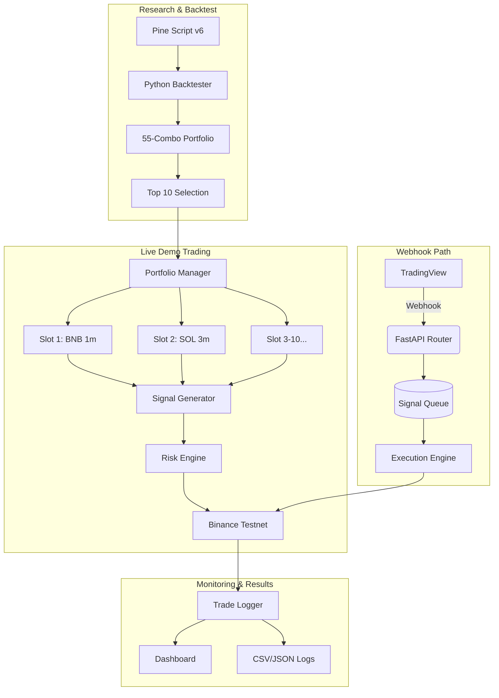

# ASR Execution Engine

A complete algorithmic trading system: TradingView Pine Script indicator → canonical Python backtester → live demo auto-trading engine with risk management.

## 📂 Project Structure

```text
ASR-Execution-Engine/
│
├── README.md                 ← Master project index (you are here)
├── pyproject.toml            ← Unified project dependency management
├── .env                      ← Environment configuration (API keys, mode)
│
├── pine_scripts/             ← Pine Script v6 indicator + strategy
│   ├── ASR_Engine.pine
│   └── ASR_Engine_Strategy.pine
│
├── backtester/               ← Python research backtester
│   ├── asr_engine.py         ← Core ASR Engine (canonical Python port, 1921 lines)
│   ├── data_engine.py        ← OHLCV downloader (ccxt + CSV cache)
│   ├── run_complete_portfolio.py ← 55-combo portfolio runner
│   ├── regenerate_charts.py  ← Chart regeneration (no backtest needed)
│   ├── config.yaml           ← All engine parameters
│   ├── data_cache/           ← Cached OHLCV CSVs (5 assets × 11 TFs)
│   └── results/portfolio/    ← Backtest output reports & charts
│
├── execution/                ← Webhook-based live execution engine
│   ├── data/                 ← Execution databases
│   ├── src/
│   │   ├── database.py       ← SQLite schema (signals, orders, fills, positions)
│   │   ├── config.py         ← Centralized settings (pydantic-settings)
│   │   ├── main.py           ← FastAPI entry point
│   │   ├── webhook/          ← TradingView webhook router
│   │   ├── queue/            ← Async signal queue with exactly-once guarantee
│   │   ├── risk/             ← Risk engine + position sizer + drift guard
│   │   ├── brokers/          ← BrokerAdapter, PaperBroker, BinanceAdapter
│   │   ├── execution/        ← Execution engine pipeline & State Machines
│   │   ├── models/           ← Enums, signal models, instrument models
│   │   └── monitoring/       ← Health monitoring
│   └── paper_sim.py          ← Standalone paper simulation
│
├── live_trading/             ← 🔥 Autonomous demo auto-trading system
│   ├── README.md             ← Live trading quick start & docs
│   ├── RESULTS.md            ← Live performance tracking (auto-updated)
│   ├── auto_trader.py        ← Main auto-trading engine
│   ├── config/
│   │   └── portfolio_allocation.yaml ← Top 10 slot allocation
│   ├── docs/
│   │   ├── STRATEGY_GUIDE.md         ← Full trading methodology
│   │   ├── PORTFOLIO_OVERVIEW.md     ← Portfolio architecture
│   │   └── RISK_FRAMEWORK.md         ← Multi-layer risk management
│   ├── results/              ← Trade logs, snapshots, equity history
│   └── logs/                 ← Runtime execution logs
│
├── tests/                    ← Unit & Integration Tests
├── docs/                     ← Strategy specification & documentation
├── evidence/                 ← Evidence pack (backtest reports, release readiness)
└── scripts/                  ← Utility scripts
```

## 🏗️ Architecture



### Two Execution Paths
1. **Autonomous Auto-Trader** (`live_trading/`): Self-contained system that generates signals internally from live OHLCV data
2. **Webhook Engine** (`execution/`): Receives signals from TradingView webhooks for manual/indicator-driven trading

## 🚀 Quick Start

```bash
# Install dependencies
pip install -e .

# Option 1: Start autonomous demo auto-trading
python -m live_trading.auto_trader

# Option 2: Run full portfolio backtest (55 combinations)
python -m backtester.run_complete_portfolio

# Option 3: Start webhook execution engine
python -m execution.src.main

# Run tests
pytest tests/
```

## 📊 Backtest Results (55 Combinations, 15,194 Trades)

| Metric | Value |
|--------|-------|
| Total Trades | 15,194 |
| Expectancy | ~0.57 R |
| Profit Factor | ~6.33 |
| Win Rate (ex BE) | ~59.8% |
| Net R (Aggregate) | 8,224.14 |
| Sharpe Ratio | ~6.62 |
| Profitable Combos | 54 / 55 (98.2%) |
| Best Combo | SOL/USDT 15m (+1,409%) |

## 🔥 Live Demo Portfolio (Top 10 Picks)

| Slot | Asset | TF | Margin | Score | Expected R |
|------|-------|----|--------|-------|-----------|
| 1 | BNB/USDT | 1m | USDT | 70.5 | 2.73R ⭐ |
| 2 | SOL/USDT | 3m | USDT | 63.3 | 1.14R |
| 3 | XRP/USDT | 1m | USDT | 59.9 | 1.27R |
| 4 | ETH/USDT | 45m | USDT | 59.5 | 0.64R |
| 5 | BNB/USDT | 4h | USDT | 56.9 | 0.83R |
| 6 | SOL/USDT | 15m | USDC | 56.1 | 0.59R |
| 7 | XRP/USDT | 45m | USDC | 55.2 | 0.52R |
| 8 | XRP/USDT | 30m | USDC | 53.2 | 0.52R |
| 9 | ETH/USDT | 4h | USDC | 52.6 | 0.73R |
| 10 | ETH/USDT | 1m | USDC | 51.8 | 1.01R |

**Total Capital:** $10,000 ($5K USDT + $5K USDC) | **$1,000 per slot** | **0.5% risk per trade**

## 🛡️ Risk Management

- **Per-Trade:** 0.5% of slot equity, structural SL, max 2.5 ATR distance
- **Per-Slot:** 3-loss circuit breaker, 25% max drawdown pause
- **Portfolio:** 15% global kill switch, max 10 concurrent positions
- **Execution:** Drift guard, order FSM, exact-once signal processing


