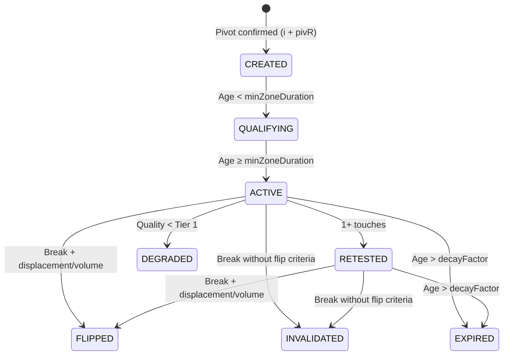

# ASR Canonical Specification (v3)

> **Definitive Reference** — This document specifies exactly how the ASR Engine generates signals, ensuring perfect parity between TradingView (Pine Script v6) and Python implementations.

---

## 📋 Table of Contents

- [Overview](#1-overview)
- [Event-Time Execution Model](#2-event-time-execution-model)
- [Zone Lifecycle](#3-zone-lifecycle)
- [Signal Scoring Formula](#4-signal-scoring-formula-0-100)
- [Risk Management](#5-risk-management)

---

## 1. Overview

The ASR (Adaptive Support/Resistance) Canonical Engine dictates exactly how signals are generated. This specification is the **authoritative contract** between the Pine Script indicator and the Python backtester/execution engine. Any behavioral divergence between implementations is a bug against this spec.

---

## 2. Event-Time Execution Model

The engine operates on **confirmed bars only** — no intrabar processing.

| Rule | Description |
|------|-------------|
| **Data Dependency** | Uses `Open`, `High`, `Low`, `Close`, `Volume` of completed bars. Intrabar ticks are never processed for signal generation. |
| **Pivot Confirmation** | A pivot high at index `i` is confirmed at index `i + pivR`. **No lookahead is allowed.** |
| **HTF Confluence** | Higher Timeframe data uses only the most recently *closed* HTF bar relative to the current LTF bar's timestamp. |

### Same-Bar Processing Order

When processing each confirmed bar, the engine follows this strict sequence:

```
Step 1: Manage Open Positions
         ├── Check Stop Loss (SL)
         ├── Check Take Profit 1 (TP1)
         ├── If TP1 hit → Evaluate new Breakeven stop dynamically (same bar)
         └── Check Take Profit 2 (TP2)

Step 2: Update Zone Lifecycle
         ├── Increment zone age
         ├── Update touch counts
         └── Apply freshness decay

Step 3: Combine / Merge Zones
         └── Merge overlapping zones within merge_atr_frac × ATR

Step 4: Scan for New Entry Signals
         └── Based on the updated (post-merge) zone state

Step 5: Execute New Entries
         └── At the Close of the current bar
```

> **Critical:** Steps must execute in this exact order. Processing exits before entries prevents phantom trades.

---

## 3. Zone Lifecycle

Each supply/demand zone transitions through the following states:



| State | Trigger | Tradeable? |
|-------|---------|-----------|
| `CREATED` | Zone initialized when a pivot is confirmed | ❌ |
| `QUALIFYING` | Zone matures until age ≥ `minZoneDuration` | ❌ |
| `ACTIVE` | Zone is eligible for trading | ✅ |
| `RETESTED` | After 1+ touches | ✅ (with touch decay) |
| `FLIPPED` | Price breaks and closes beyond with displacement/volume confirmation | ❌ (polarity reversed) |
| `DEGRADED` | Quality score drops below Tier 1 threshold | ❌ |
| `INVALIDATED` | Price broke the zone without flip criteria | ❌ |
| `EXPIRED` | Age exceeds `decayFactor` | ❌ |

### Zone Width Calculation
- **Resistance (Supply):** `Top = High`, `Bottom = max(Close, Open)`
- **Support (Demand):** `Bottom = Low`, `Top = min(Close, Open)`
- **Zone Boundaries:** `pivot price ± zoneMult × ATR(20)`

---

## 4. Signal Scoring Formula (0-100)

Each potential trade signal receives a composite score across three dimensions:

### 4.1 Zone Quality Score (0-35 points)

| Factor | Points | Criteria |
|--------|--------|----------|
| Displacement | 0-8 | Departure impulse from zone |
| Touches | 0-6 | First two touches add up to 6; >3 touches subtract |
| Reaction Earned | +4 | If zone produced a visible reaction; fast reaction +2 |
| HTF Confluence | +5 | Zone aligns with Higher Timeframe zone |
| MTF Confluence | +3 | Zone aligns with Medium Timeframe zone |
| PDW Confluence | +2 | Previous Day/Week level alignment |
| Volume | +1 to +3 | Volume surge at zone formation |
| **Freshness Decay** | Multiplier | `freshness = max(0, 100 - age × 100 / (2 × decayFactor))` |

### 4.2 Setup Score (0-35 points)

| Factor | Points | Criteria |
|--------|--------|----------|
| Base Setup Type | 10-15 | Reject=10, Flip=13, Sweep=15, Disp=12, BOS=11 |
| Wick Quality | 0-8 | Rejection wick length relative to ATR |
| Break Displacement | 0-7 | Impulse strength on zone break |
| Flip Bonus | +5 | If setup involves a zone polarity flip |

### 4.3 Context Score (0-30 points)

| Factor | Points | Criteria |
|--------|--------|----------|
| Trend Alignment | +10 | Signal direction matches EMA-based trend |
| Volatility Regime | +2 to +5 | Normal=+5, High=+2, Low=+3 |
| Structure State | +5 | CHoCH/BOS confirmation |
| Volume Confirmation | +2 to +5 | Volume above SMA threshold |
| Sweep Context | +5 | Liquidity sweep detected |

### Minimum Score for Entry: **45** (configurable via `min_score`)

---

## 5. Risk Management

| Parameter | Formula | Description |
|-----------|---------|-------------|
| **Stop Loss** | Zone extreme ± `slBufferATR × ATR` | Structural stop beyond the zone boundary |
| **TP1** | `Entry + tp1R × Risk` | First partial target (33% of position); SL moves to Breakeven |
| **TP2** | `Entry + tp2R × Risk` | Second partial target (33% of position) |
| **Trail** | `1.5 × ATR` trailing stop | Runner portion (34% of position) |
| **Time Stop** | `timeStopBars` bars after entry | Close all remaining position at market |
| **Max Risk Distance** | `2.5 × ATR` | Reject entries with SL wider than this |

---

*This specification is maintained alongside the codebase. Both Pine Script and Python implementations must conform to these rules. Deviations are treated as bugs.*
