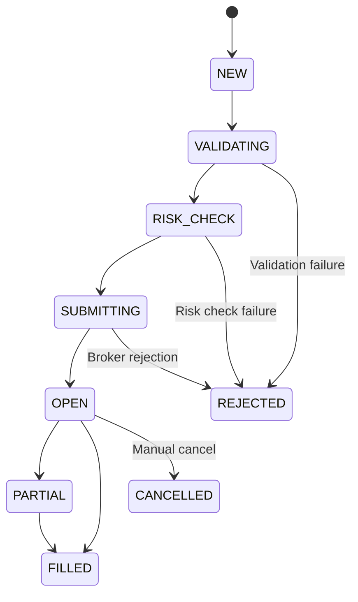
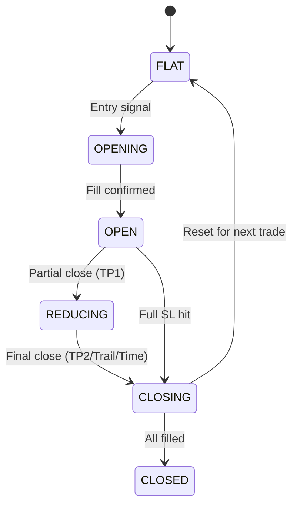

# ASR Engine v3 — Canonical Strategy Specification

> ⚠️ **Single Source of Truth** — Both the Pine Script indicator/strategy and the Python Execution Engine **MUST** conform to the rules in this document. Any deviation is a bug.

---

## 📋 Table of Contents

- [Overview](#1-overview)
- [Core Concepts](#2-core-concepts)
- [Signal Generation (Entries)](#3-signal-generation-entries)
- [Trade Management (Exits)](#4-trade-management-exits)
- [State Transitions](#5-state-transitions)
- [Execution Semantics](#6-execution-semantics)

---

## 1. Overview

| Property | Value |
|----------|-------|
| **Name** | ASR Engine v3 (Advanced Support & Resistance) |
| **Type** | Structural Price Action Trading System |
| **Markets** | Crypto Perpetual Futures (Binance USDⓈ-M) |
| **Direction** | Long and Short |
| **Holding Period** | Intrabar (1m scalps) to multi-day (4h swings) |

The ASR Engine detects structural supply and demand zones, validates them with price action context (FVG, CHoCH, Regime), and executes trades mechanically with strict risk management.

---

## 2. Core Concepts

### 2.1 Zones (Supply & Demand)

| Property | Description |
|----------|-------------|
| **Definition** | A Support (Demand) or Resistance (Supply) zone formed by a confirmed Swing Pivot |
| **Confirmation Delay** | A pivot at index `i` is NOT known until `i + pivR`. Zone is `CREATED` at `i + pivR` |
| **Polarity** | `+1` for Resistance (look for Shorts), `-1` for Support (look for Longs) |

**Zone Boundary Calculation:**

| Zone Type | Top | Bottom |
|-----------|-----|--------|
| Resistance (Supply) | `High` | `max(Close, Open)` |
| Support (Demand) | `min(Close, Open)` | `Low` |

### 2.2 Liquidity & Structure

| Concept | Description |
|---------|-------------|
| **Fair Value Gap (FVG)** | Measured at the departure from the zone. A strong FVG immediately following a pivot validates the displacement. |
| **Change of Character (CHoCH)** | Evaluated against the most recent opposite pivot. If a new Demand zone breaks above the previous Supply pivot, it confirms a bullish structural shift. |

### 2.3 Setup Types

| # | Setup | Description | Signal Weight |
|---|-------|-------------|---------------|
| 1 | **ZONE_REJECT** | Price enters the zone, wick rejects at the extreme, closes back inside/away | Primary |
| 2 | **FLIP_RETEST** | Old resistance becomes support (or vice versa) | High |
| 3 | **SWEEP_RECLAIM** | Liquidity sweep beyond level, price reclaims within 3 bars | High |
| 4 | **DISPLACEMENT_RETEST** | Impulsive FVG move creates displacement, then retest | Medium |
| 5 | **BOS_RETEST** | Break of Structure, then retest of the broken level | Medium |

---

## 3. Signal Generation (Entries)

### 3.1 Gating / Context Filters

A zone rejection generates an `ENTRY` signal **only if ALL** of these conditions are met:

| # | Filter | Requirement |
|---|--------|-------------|
| 1 | **Trend Alignment** | Zone polarity matches the HTF Trend (EMA-based) |
| 2 | **Volatility Regime** | Market volatility is within acceptable bounds (ATR filter) |
| 3 | **Quality Score** | Zone's composite score ≥ `MIN_SCORE` (default: 45) |
| 4 | **Wick Quality** | Rejection wick > 50% of body AND > 0.15 × ATR |
| 5 | **Volume** | Above 80% of 20-period SMA |
| 6 | **Risk Distance** | Entry to SL < 2.5 × ATR |
| 7 | **No Existing Position** | No open position on the same symbol |
| 8 | **Daily Limit** | Not exceeded `max_sig_per_day` for this slot |
| 9 | **Not Paused** | Slot circuit breaker not triggered |

### 3.2 Order Intent

When an entry condition is met on a *closed bar*:

| Field | Calculation |
|-------|-------------|
| **Direction** | `LONG` (Support reject) or `SHORT` (Resistance reject) |
| **Entry Price** | Close price of the signal bar |
| **Stop Loss** | Zone extreme + ATR buffer (e.g., `Low − 0.5 × ATR` for Longs) |
| **Take Profit 1** | `Entry + 1.5 × (Entry − Stop)` |
| **Take Profit 2** | `Entry + 3.0 × (Entry − Stop)` |

---

## 4. Trade Management (Exits)

### 4.1 Fractional Exit Model (5 Stages)

```
                    ┌── Stage 1: Full SL Hit → 100% closed (−1R)
                    │
Entry ──────────────┼── Stage 2: TP1 Hit → 33% closed (+1.5R)
                    │                       SL moves to Breakeven
                    │
                    ├── Stage 3: TP2 Hit → 33% closed (+3.0R)
                    │                       Remainder becomes "Runner"
                    │
                    ├── Stage 4: Runner Trail → 34% trails ATR stop
                    │                           (1.5 × ATR trailing)
                    │
                    └── Stage 5: Time Stop → Close all at Market
                                             after MAX_BARS (default: 60)
```

| Stage | Trigger | Position % | Action |
|-------|---------|-----------|--------|
| 1 | SL hit | 100% | Close all. Loss = 1R |
| 2 | TP1 hit | 33% | Close partial. Move SL to Breakeven |
| 3 | TP2 hit | 33% | Close partial. Remainder becomes runner |
| 4 | Trail stop hit | 34% | ATR-based trailing stop for runner |
| 5 | Time stop | 100% remaining | Close at market after `MAX_BARS` |

### 4.2 Slippage & Fees

| Parameter | Value | Description |
|-----------|-------|-------------|
| Entry Order | `MARKET` | Market order at bar close |
| Stop Loss | `STOP_MARKET` | Stop order placed immediately |
| Take Profits | `LIMIT` | Limit orders for TP1/TP2 |
| Taker Fee | 0.04% per side | Applied to market fills |
| Slippage | 0.02% per side | Paper engine assumption |
| Drift Guard | 0.5% max | Reject if current price drifts > 0.5% from signal |

---

## 5. State Transitions

### 5.1 Order FSM



### 5.2 Position FSM



---

## 6. Execution Semantics

| Component | Role | Details |
|-----------|------|---------|
| **Pine Script** | Visual + Signaling Layer | Fires webhooks on the Close of the signal bar. Provides chart overlays for zone visualization. |
| **Python Engine** | Authoritative Risk Manager | Verifies signal TTL, checks global drawdown limits, dynamically calculates position size using exact `Decimal` arithmetic, and routes to the Venue API. |

### Signal Flow

```
Pine Script (TradingView)
    │ Webhook (JSON)
    ▼
FastAPI Router
    │ Validated Signal
    ▼
Signal Queue (Exactly-Once)
    │ Dequeued Signal
    ▼
Risk Engine (Sizing + Drift + DD)
    │ Approved Order
    ▼
Execution Engine (Order FSM)
    │ Broker API Call
    ▼
Binance Futures (Fill)
    │ Confirmation
    ▼
Position FSM (State Update)
```

---

*Last updated: v3.0.0 | This specification governs both Pine Script and Python implementations.*
