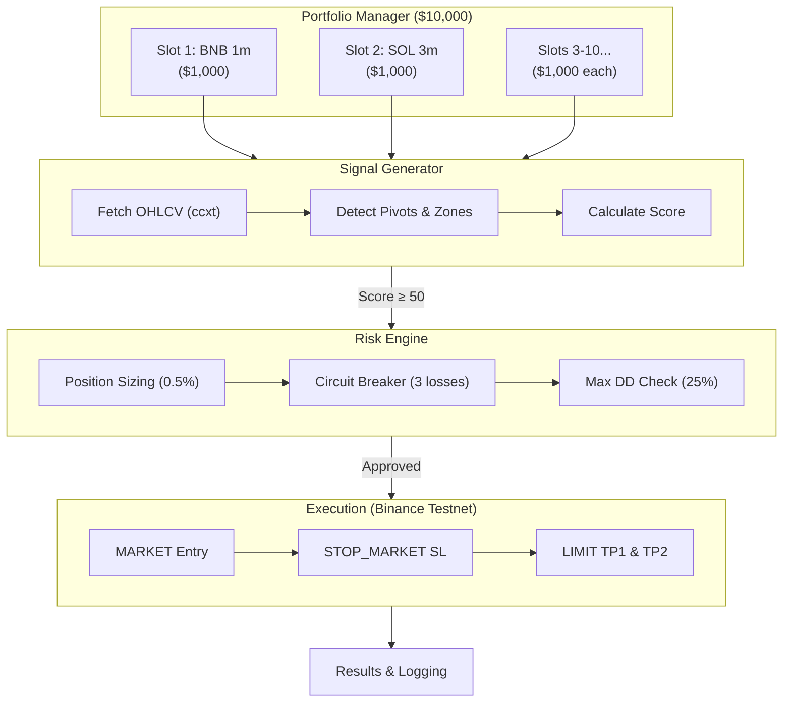

# ASR Engine v3 — Live Demo Auto-Trading System

> **Autonomous Execution Layer** — A self-contained, real-time trading engine that fetches market data, generates ASR signals, and manages a multi-slot portfolio on Binance Futures.

---

## 🚀 Quick Start

```bash
# 1. Install dependencies (from project root)
pip install -e .

# 2. Configure environment (ensure .env has Binance Testnet keys)
# BINANCE_API_KEY=...
# BINANCE_API_SECRET=...
# BINANCE_USE_TESTNET=true

# 3. Start the auto-trader
python -m live_trading.auto_trader
```

The system will:
1. Connect to Binance Testnet using your API keys
2. Load the Top 10 portfolio allocation (10 slots × $1,000)
3. Start a continuous loop scanning for ASR signals across all 10 asset+TF combinations
4. Execute trades automatically with full risk management
5. Display a real-time dashboard in your terminal
6. Log all trades to `results/trade_log.csv`

---

## 📂 Directory Structure

```text
live_trading/
├── README.md                              ← You are here
├── RESULTS.md                             ← Live trading results (auto-updated)
├── auto_trader.py                         ← 🔥 Main auto-trading engine
├── __init__.py
│
├── config/
│   └── portfolio_allocation.yaml          ← Top 10 slot allocation configuration
│
├── docs/                                  ← Live trading documentation
│   ├── STRATEGY_GUIDE.md                  ← Full trading methodology
│   ├── PORTFOLIO_OVERVIEW.md              ← Portfolio architecture & slot details
│   └── RISK_FRAMEWORK.md                  ← Multi-layer risk management rules
│
├── results/                               ← Output generated during runtime
│   ├── trade_log.csv                      ← All trades (entries + exits)
│   ├── portfolio_snapshot.json            ← Latest portfolio state
│   ├── portfolio_history.jsonl            ← Equity curve data points
│   └── session_report.json                ← Per-session summary
│
└── logs/                                  ← Runtime execution logs
    └── auto_trader_YYYYMMDD_HHMMSS.log    ← Detailed system log
```

---

## 🏗️ Architecture



---

## 📊 Portfolio Allocation

The system trades a diversified portfolio selected from the 55-combination backtest.

| Slot | Asset | TF | Margin | Capital | Score | Expected R | Character |
|------|-------|----|--------|---------|-------|------------|-----------|
| 1 | **BNB/USDT** | 1m | USDT | $1,000 | 70.5 ⭐ | 2.73 R | High-frequency scalp |
| 2 | **SOL/USDT** | 3m | USDT | $1,000 | 63.3 | 1.14 R | Clean signal micro-swing |
| 3 | **XRP/USDT** | 1m | USDT | $1,000 | 59.9 | 1.27 R | Volatility scalping |
| 4 | **ETH/USDT** | 45m | USDT | $1,000 | 59.5 | 0.64 R | Balanced swing |
| 5 | **BNB/USDT** | 4h | USDT | $1,000 | 56.9 | 0.83 R | Multi-day structural |
| 6 | **SOL/USDT** | 15m | USDC | $1,000 | 56.1 | 0.59 R | High-return intraday |
| 7 | **XRP/USDT** | 45m | USDC | $1,000 | 55.2 | 0.52 R | Medium-term swing |
| 8 | **XRP/USDT** | 30m | USDC | $1,000 | 53.2 | 0.52 R | Multi-TF coverage |
| 9 | **ETH/USDT** | 4h | USDC | $1,000 | 52.6 | 0.73 R | Macro trend plays |
| 10 | **ETH/USDT** | 1m | USDC | $1,000 | 51.8 | 1.01 R | High volume scalp |

---

## ⚙️ Configuration

### Environment Variables (`.env`)
```env
TRADING_MODE=DEMO
BINANCE_API_KEY=your_key
BINANCE_API_SECRET=your_secret
BINANCE_USE_TESTNET=true
RISK_PER_TRADE_PCT=0.5
MAX_GLOBAL_DRAWDOWN_PCT=15.0
```

### Portfolio Config (`config/portfolio_allocation.yaml`)
Control the capital distribution, add/remove slots, and adjust risk parameters without touching code.

---

## 🛡️ Risk Management

| Layer | Protection | Details |
|-------|-----------|---------|
| **Per-Trade** | 0.5% max risk | Exact `Decimal` sizing; structural SL; max 2.5 ATR distance |
| **Per-Slot** | Circuit breakers | Pause for 30m after 3 losses; freeze on >25% slot drawdown |
| **Portfolio** | Global kill switch | Halt all trading if total portfolio drawdown exceeds 15% |
| **Execution** | Drift & Rate limits | Max 0.3% price drift from signal; ccxt rate limit handling |

See [`docs/RISK_FRAMEWORK.md`](docs/RISK_FRAMEWORK.md) for a deep dive.

---

## 📈 Monitoring

### Real-Time Terminal Dashboard
The engine renders a dynamic dashboard in the console, refreshing automatically:

```text
================================================================================
  ASR ENGINE v3 — LIVE DEMO TRADING DASHBOARD
================================================================================
  Runtime: 2.5h | Mode: DEMO (Testnet) | Updated: 21:30:00
--------------------------------------------------------------------------------
  💰 Portfolio: $10,045.23 (Start: $10,000.00)
  📊 PnL: $+45.23 (+0.45%)
  📉 Max DD: 0.82% | Peak: $10,052.10
  🔄 Trades: 12 | Wins: 8 | Open: 2
  📈 Win Rate: 66.7%
--------------------------------------------------------------------------------
  Slot | Symbol     | TF    | Margin | Equity     | PnL        | Trades | Status
  -----------------------------------------------------------------------
     1 | BNBUSDT    | 1m    | USDT   |  $1,012.34 |    $+12.34 |      4 | ✅ READY
     2 | SOLUSDT    | 3m    | USDT   |  $1,003.45 |     $+3.45 |      2 | 📈 OPEN
  ...
================================================================================
```

---

## 🔧 Troubleshooting

| Issue | Cause & Solution |
|-------|------------------|
| `ModuleNotFoundError: No module named 'ccxt'` | Run `pip install -e .` from project root |
| API Authentication Error | Verify `.env` contains correct Binance **Testnet** keys |
| "Markets not loaded" | Temporary ccxt rate limit. Wait a moment and retry |
| No signals generating | Expected behavior. The system only trades high-quality setups |
| "Position size too small" | Entry-to-SL distance is wide. Requires more capital or wider SL limit |
| Status: 🛑 PAUSED | Circuit breaker triggered. Check logs, reset manually if desired |

---

## 🔗 Related Documentation

- [Strategy Guide](docs/STRATEGY_GUIDE.md) — Comprehensive trading methodology
- [Portfolio Overview](docs/PORTFOLIO_OVERVIEW.md) — Detailed slot analysis and correlation
- [Risk Framework](docs/RISK_FRAMEWORK.md) — Multi-layer defense architecture
- [Trading Results](RESULTS.md) — Live performance tracking (auto-updated)
