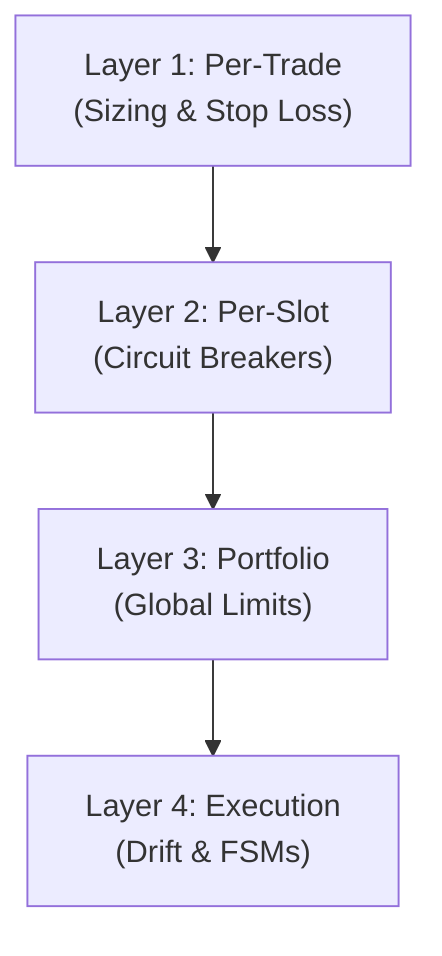

# ASR Engine v3 — Risk Management Framework

> **Defense in Depth** — The multi-layered risk architecture designed to protect capital. The system guarantees that no single failure (code, exchange, or market) can cause catastrophic loss.

---

## 📋 The 4-Layer Defense Architecture



---

## 🛡️ Layer 1: Per-Trade Risk

Risk is strictly capped per individual trade.

### Position Sizing Formula
```
Risk Amount = Slot Equity × 0.5%
Position Size = ROUND_DOWN(Risk Amount / |Entry Price − Stop Loss Price|)
```

**Example (Slot 1: BNB/USDT 1m, $1,000 equity):**
- Risk Amount = $1,000 × 0.005 = **$5.00**
- Entry = $620.50, SL = $618.00 → Distance = $2.50
- Position Size = $5.00 / $2.50 = **2.0 BNB**
- Max Loss on this trade = $5.00 (0.5% of slot equity)

### Hard Constraints
| Constraint | Implementation | Benefit |
|------------|----------------|---------|
| **No Rounding Up** | Uses `Decimal` rounding down | Never risks a penny more than 0.5% |
| **Max Risk Distance** | Reject if Entry-SL > 2.5 ATR | Prevents buying into extreme volatility |
| **Structural SL** | Placed beyond zone + ATR buffer | Allows trade to breathe without random stop-outs |

---

## 🛑 Layer 2: Per-Slot Risk (Circuit Breakers)

Each of the 10 slots operates in isolation. A failing slot cannot consume capital from healthy slots.

| Trigger Condition | Action Taken | Resolution |
|-------------------|--------------|------------|
| **3 Consecutive Losses** | Slot Paused for 30 mins | Auto-resumes after cooldown |
| **Slot Drawdown > 25%** | Slot Frozen indefinitely | Requires manual intervention |
| **Single Loss > 3%** | Flagged as anomaly | Logged; indicates extreme slippage |

---

## 🌍 Layer 3: Portfolio Risk

Global limits protect against systemic market crashes or severe algorithmic bugs.

### The Global Kill Switch
```
Portfolio DD = (Peak Equity − Current Equity) / Peak Equity × 100
```
> 🔴 **If Portfolio DD > 15% → GLOBAL KILL SWITCH ACTIVATED**
> All trading halts instantly. All slots are frozen.

### Global Constraints
| Limit | Value | Protection |
|-------|-------|------------|
| **Max Slots** | 10 | Caps maximum possible exposure |
| **Max Global Positions**| 10 | Prevents over-leverage |
| **Max Daily Trades** | 4 per slot | Prevents overtrading / commission burn |
| **Margin Split** | 50% USDT / 50% USDC | Mitigates stablecoin depeg risk |

---

## ⚙️ Layer 4: Execution Risk

Technical protections against infrastructure and latency issues.

### Drift Guard
If the market moves significantly between signal generation and order placement:
```
Drift = |Current Price − Signal Price| / Signal Price × 100
```
> 🚫 **If Drift > 0.3% → Signal Rejected** (Prevents entering at terrible prices)

### Deterministic State Machines (FSM)
Orders and Positions must transition through strict state machines. They cannot "skip" steps (e.g., an order cannot become `FILLED` without passing `RISK_CHECK`).

---

## 💀 Worst-Case Scenarios

How the system behaves under extreme duress:

### Scenario 1: Slot Death Spiral
**Event:** A strategy fails completely in a new market regime.
**Result:** After 3 losses (~1.5% loss), it pauses for 30m. If it continues losing, it hits the 25% slot drawdown limit and is frozen forever. Maximum impact to the total portfolio is 2.5% (since the slot is 1/10th of capital).

### Scenario 2: Flash Crash
**Event:** Entire market drops 10% in 1 minute.
**Result:** Structural stop losses are already resting on the exchange. Some slippage occurs. Max per-slot risk is ~0.5%. Even with 3x slippage across all 10 slots simultaneously, total portfolio impact is ~1.5%.

### Scenario 3: Exchange Outage / Disconnect
**Event:** Binance goes offline or network drops.
**Result:** Webhooks fail to deliver or orders fail to submit. The Signal Queue's TTL (Time-To-Live) ensures that when connection restores, old signals are discarded. No stale trades are executed.

---

*All risk parameters are configurable via `config/portfolio_allocation.yaml`.*
